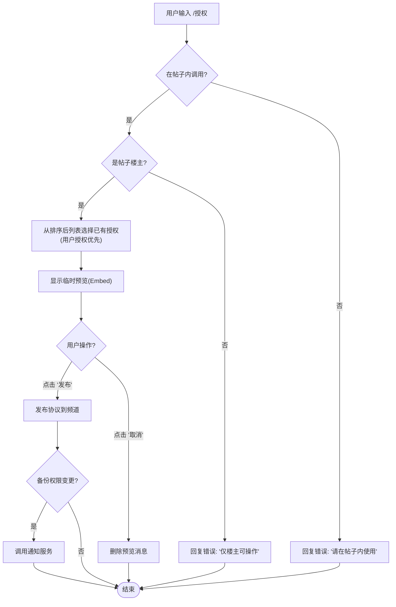
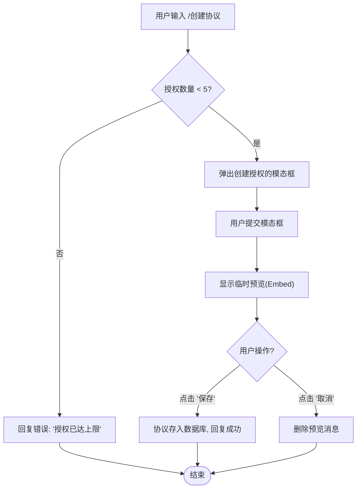
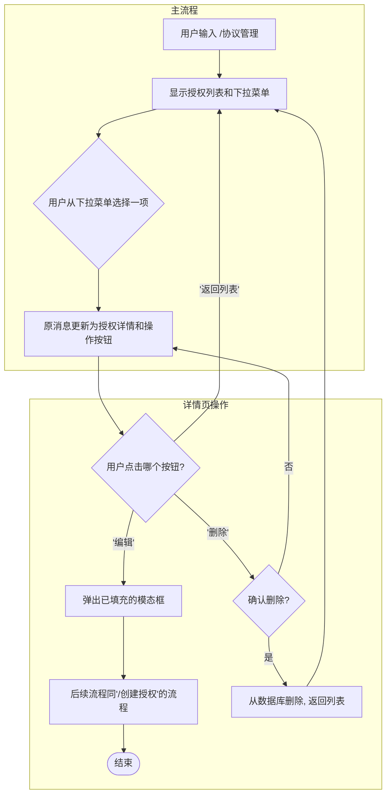
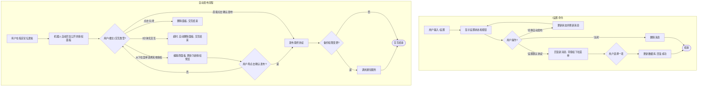
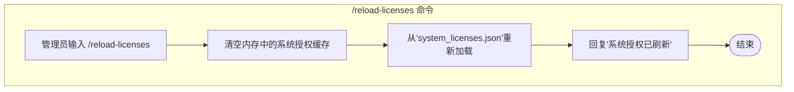
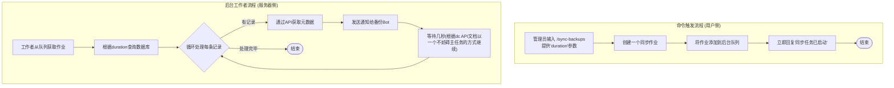

## 1. 项目概述


本项目是一个 Discord 机器人，旨在帮助社区内用户方便地为自己的作品（如艺术品、代码、文档等）声明授权协议。机器人通过一系列斜杠命令和交互式组件，简化了创建、管理和应用授权协议的流程，并能在用户在特定频道发布内容时自动附加授权信息。
无论如何该社区的红线和底线是反商业化,任何协议都应是反商业化的.系统授权协议 CC-BY-NC 4.0.

  
## 2. 核心功能需求

### 2.1. 授权协议声明

机器人必须提供一个核心命令，允许用户应用一个**已有的**授权协议到自己的作品上。

- **命令**: `/授权`
- **输入参数**:
    - `协议`: (必选) 用户通过自动补全从一个列表中选择一个**已有的**授权协议。
        - **显示顺序**: 列表的选项应优先显示用户的个人授权，然后是系统授权。
        - **数量限制**: 由于 Discord API 限制，自动补全最多显示 25 个选项。
    - `备份权限`: (可选) 一个选项，用于在本次发布时覆盖授权中的备份权限设置。
- **流程**:
    1.  **前置安全检查**:
        - **上下文验证**: 命令必须在**帖子（Thread）**内调用。此规则适用于所有频道类型（包括普通聊天频道和论坛频道）。若在非帖子环境中使用，则命令失败并回复错误：“请在您创建的帖子中使用本命令。”
        - **权限验证**: 调用命令的用户必须是当前帖子的创建者（楼主）。若非楼主调用，则命令失败并回复错误：“您只能为自己创建的帖子添加授权协议。”
    2.  用户选择一个授权后，机器人生成并展示一个授权协议的预览。
    3.  生成预览后，用户可以通过 `[✅ 发布]` / `[❌ 取消]` 按钮进行操作。
    4.  发布时检查帖子是否已有协议，并执行替换/废弃旧协议的逻辑。
    5.  **发布成功后，若协议中的备份权限状态与之前相比发生变更，则调用通知服务，按照以下的格式发送 POST 请求。**
     ```json
   {

  "event_type": "backup_permission_update",

  "timestamp": "2025-01-04T10:30:00Z",

  "guild_id": "123456789012345678",

  "channel_id": "987654321098765432",

  "thread_id": "456789012345678901",

  "message_id": "789012345678901234",

  "author": {

    "discord_user_id": "111222333444555666",

    "username": "用户名",

    "display_name": "显示名称"

  },

  "work_info": {

    "title": "作品标题",

    "content_preview": "作品内容预览...(前100字符)",

    "license_type": "custom",

    "backup_allowed": true

  },

  "urls": {

    "discord_thread": "https://discord.com/channels/server/channel/thread",

    "direct_message": "https://discord.com/channels/server/channel/message"

  }

}
    ```

### 2.2. 创建协议

机器人必须提供一个专门的命令，让用户创建并保存自定义的授权。

- **命令**: `/创建协议`
- **流程**:
    1.  用户输入命令。
    2.  **系统检查用户已保存的授权数量。如果已达到上限（5个），则回复错误消息“您的个人授权已达数量上限（5个），请使用 `/协议管理` 删除一些不用的授权。”并终止流程。**
    3.  机器人弹出一个模态框，让用户自定义以下内容：
        - 协议名称
        - 二传（允许/禁止）
        - 二改（允许/禁止）
        - 二传二改限制说明（可选，详细文本,如果前面两项都为否则不在最终的embed显示并且不保存到数据库）
        - 管理组备份权限（可选.允许/禁止）
    4.  用户提交后，机器人生成预览。
    5.  用户可以通过 `[💾 保存]` / `[❌ 取消]` 按钮进行操作。保存后，授权将存入用户的授权数据库。

### 2.3. 协议管理

用户应该能够查看和管理自己的常用授权，以便快速复用。

- **命令**: `/协议管理`
- **功能**:
    - 显示一个私有消息，列出用户所有已保存的自定义授权。
    - 列表应包含协议名称、使用次数和创建日期。
    - 提供交互式组件（如下拉菜单和按钮），允许用户对已有授权进行操作（如：**编辑、删除**）。

### 2.4. 个人化设置

用户可以配置机器人的行为，以适应自己的工作流程。

- **命令**: `/设置`
- **功能**:
    - 提供一个私有的设置面板，包含以下操作：
    - **切换自动发布**: 启用或禁用在指定论坛频道发帖时自动附加授权面板的功能。
    - **设置默认协议**: 提供一个按钮和下拉菜单，允许用户从自己的授权列表中，选择一个作为自动发布时的默认协议。
    - **自动发布流程**: 启用后，自动发布的面板将使用用户的默认协议生成预览。面板提供一个下拉菜单让用户切换**已有的**授权。切换后，面板内容更新。用户可最终确认发布或关闭面板。面板在3分钟无交互后会自动删除。

### 2.5. 管理员命令

提供仅限管理员使用的高级维护命令。

- **命令**: `/sync-backups`
- **权限**: 仅限 `admin_users` 列表中的用户。
- **必选参数**: `duration` (例如 `24h`, `30m`) - 一个必须提供的时间范围参数，用于指定同步该时间范围内的记录。**为防止滥用，此参数上限为 `7d` (7天)**。支持的单位为 `m` (分钟), `h` (小时), `d` (天)。
- **功能**: 将一个增量数据同步作业添加到后台队列。机器人会立即回复“任务已启动”，并在后台以受控的慢速（例如，每条记录间隔1-2秒）执行以下操作：
    1.  遍历数据库中在指定时间范围内的 `published_posts` 记录。
    2.  为每条记录通过 Discord API 获取最新的元数据。
    3.  将完整的记录发送给备份Bot。
    此命令用于在备份Bot短暂离线后，进行数据校对和补发，同时避免API调用风暴。

  

## 3. 非功能性需求

  

### 3.1. 安全性


- **权限控制**: 

    - 机器人应具备权限管理系统。配置文件中应包含 `admin_users` 列表。

    - **管理员 (Admin)**: 拥有机器人特殊命令权限，比如和备份bot同步列表。
 
    - 凡是非ephemeral的面板（在帖子下方的自动发布面板）应该实现鉴权，仅楼主可操作。

- **强制服务器鉴权 (Mandatory Server Authentication)**:
    - 为确保机器人只在授权的服务器中运行，机器人启动时必须进行服务器鉴权。
    - 只有在配置文件 `config.toml` 的 `allowed_guild_ids` 列表中明确指定的服务器（Guilds），机器人才会注册其斜杠命令。
    - **此功能为强制性安全措施，不可禁用。** 如果 `allowed_guild_ids` 列表为空，机器人将拒绝启动并打印错误日志。

- **速率限制**: 为防止滥用，机器人涉及到dc api的关键调用操作应有速率限制（冷却时间）。这些限制应可在配置文件中进行调整。

- 统一的错误处理 (src/error.rs)
	创建一个 src/error.rs 文件，定义一个全局的、自定义的 enum AppError。
```
// In src/error.rs
pub enum AppError {
    DatabaseError(sqlx::Error),
    NetworkError(reqwest::Error),
    ConfigError(String),
    NotFound(String),
    // ... etc
}
```

### 3.2. 数据存储

  
- 机器人需要一个数据库来持久化存储以下信息：

- 用户设置（如自动发布开关、默认授权）
- 用户自定义的授权内容
- 帖子的thread_id和备份许可状态，bot发送的协议消息id（未发送协议时留空），用于和备份bot同步，或者在同帖子下发送新协议时unpin旧协议并编辑作废
- 数据库应通过配置文件中的 `database_url` 指定，支持 SQLite。
- 还应该有个`config/system_licenses.json`来存储系统授权并支持启动时加载到数据库

### 3.3. 可配置性

  

机器人的核心参数必须是可配置的，通过一个 `config.toml` 文件进行管理。


- **必填项**:

    - `discord_token`: Discord 机器人令牌。

    - `application_id`: Discord 应用 ID。

    - `database_url`: 数据库连接字符串。

- **可选/可调整项**:

    - Notification URL 及开关。

    - 各个命令的速率限制冷却时间。

    - 管理员用户列表。


  

### 3.4. 外部通信

  

- 机器人支持通过 Notification 向外部服务发送通知，例如在帖子备份权限更新时进行备份。此功能应可通过配置启用或禁用。

### 3.5. 性能与配置更新

- **系统授权缓存**: 为提高高并发下的性能，系统授权应在程序启动时加载到内存缓存中，避免频繁的文件I/O。
- **配置热重载**: 系统应提供一个仅限管理员使用的命令 `/reload-licenses`，用于在不重启服务的情况下，从 `system_licenses.json` 文件安全地重新加载和刷新系统授权缓存。

  

## 4. 文件结构与部署

  

- **配置文件**: 项目根目录下应有一个 `config.example.toml` 作为模板，用户需复制为 `config.toml` 并填入自己的配置。

- **数据库文件**: 默认情况下，SQLite 数据库文件应存储在 `data/` 目录下。
- 项目结构如下
```
.
├── config.example.toml  # 配置项目的各项变量
├── Cargo.toml          # 项目依赖和元数据
├── config/
│   └── system_licenses.json # 系统授权协议
├── migrations/
│   └── ...               # SQLx 数据库迁移脚本
└── src/
    ├── main.rs           # 程序入口：初始化、启动机器人
    ├── lib.rs            # 库的根模块
    ├── bot/              # 机器人交互层 (UI/UX)
    │   ├── poise_commands.rs # 定义所有斜杠命令
    │   ├── utils/          # 编排embed块的构建实现，实现modal框构建和返回数据
    │   └── handlers/       # 处理按钮、模态框等交互事件
    │       └── ...
    │   
    ├── core/             # 核心业务逻辑与数据结构
    │   ├── config.rs       # 定义配置的数据结构
    │   └── license_loader.rs  # 加载系统授权
    ├── services/         # 业务服务层 (解耦)
    │   ├── license_service.rs # 授权和协议管理
    │   ├── user_service.rs    # 用户设置管理
    │   ├── notification_service.rs  # 专门负责发送Post请求给备份bot。它封装了所有与外部 HTTP 通信相关的技术细节。
    │   └── rate_limit_service.rs # 速率限制逻辑
    └── database/         # 数据访问层,只对外提供必要接口，包装直接的sql操作
        └── mod.rs          # 数据库连接和仓储模式实现

```
 

## 5. 数据模型

本章节详细定义了项目所需的核心数据库表结构，这将是 `migrations` 目录下数据库迁移脚本的基础。

### 5.1. `user_licenses` - 用户自定义授权

这个表用来存储每个用户创建的个人授权模板。

| 字段名                    | 数据类型     | 约束            | 描述              |
| :--------------------- | :------- | :------------ | :-------------- |
| `id`                   | INTEGER  | PRIMARY KEY   | 授权的唯一ID (自增整数)  |
| `user_id`              | BIGINT   | NOT NULL      | 创建者的Discord用户ID |
| `license_name`         | TEXT     | NOT NULL      | 用户为授权起的名字       |
| `allow_redistribution` | BOOLEAN  | NOT NULL      | 是否允许二传          |
| `allow_modification`   | BOOLEAN  | NOT NULL      | 是否允许二改          |
| `restrictions_note`    | TEXT     |               | 限制说明的详细文本       |
| `allow_backup`         | BOOLEAN  | NOT NULL      | 是否允许管理组备份       |
| `usage_count`          | INTEGER  | DEFAULT 0     | 该授权被使用的次数       |
| `created_at`           | DATETIME | DEFAULT now() | 创建时间            |

### 5.2. `user_settings` - 用户个人设置

这个表存储每个用户的个人配置。

| 字段名                    | 数据类型    | 约束            | 描述                           |
| :--------------------- | :------ | :------------ | :--------------------------- |
| `user_id`              | BIGINT  | PRIMARY KEY   | 用户的Discord用户ID               |
| `auto_publish_enabled` | BOOLEAN | DEFAULT FALSE | 是否启用自动发布                     |
| `default_license_id`   | INTEGER | FOREIGN KEY   | 默认授权ID，关联 `user_licenses.id` |

*注：`default_license_id` 可以为 NULL，表示用户未设置默认授权。*

### 5.3. `published_posts` - 已发布协议的帖子记录

这个表用来跟踪机器人在哪些帖子里发布了协议，以便进行更新、废弃和通知操作。

| 字段名              | 数据类型     | 约束            | 描述              |
| :--------------- | :------- | :------------ | :-------------- |
| `thread_id`      | BIGINT   | PRIMARY KEY   | 帖子的Discord线程ID  |
| `message_id`     | BIGINT   | NOT NULL      | 机器人发布的协议消息的ID   |
| `user_id`        | BIGINT   | NOT NULL      | 发布者的Discord用户ID |
| `backup_allowed` | BOOLEAN  | NOT NULL      | 当前帖子最终生效的备份权限状态 |
| `updated_at`     | DATETIME | DEFAULT now() | 最后更新时间          |


## 6. 交互流程图 (Mermaid)

本章节使用 Mermaid 流程图来可视化核心命令的交互逻辑。

### 6.1. /授权 命令流程 (应用已有协议)



### 6.2. /创建协议 命令流程 (新增)



### 6.3. /协议管理 命令流程



### 6.4. /设置 与自动发布流程



### 6.5. 管理员命令流程




## 7. 系统授权文件规范 (`system_licenses.json`)

本章节定义了 `config/system_licenses.json` 文件的格式规范，以指导开发者（包括AI）进行维护和扩展。

### 7.1. 设计原则

- **运行时加载**: 系统授权在程序运行时直接从本JSON文件读取，而不会被写入数据库。这确保了系统配置（本文件）与用户数据（数据库）的清晰分离。
- **逻辑与外观分离**: 文件内容分为 `licenses` (定义授权的逻辑属性) 和 `templates` (定义授权的显示外观)，以增强可维护性和未来扩展性。
- **统一标题**: 所有协议的最终 Embed 消息将共享一个在程序中定义的通用标题（如“授权协议”），因此本文件无需也无法指定标题。

### 7.2. 文件格式与结构

- **文件格式**: 必须是严格的 **JSON** 格式。
- **顶层结构**: 必须是一个包含 `licenses` 和 `templates` 两个键的对象，其值都必须是**数组 (Array)**。

### 7.3. `licenses` 对象结构

定义授权的**核心属性和元数据**。

| 字段名 | 类型 | 是否必须 | 描述 |
| :--- | :--- | :--- | :--- |
| `name` | String | **是** | 授权的内部唯一标识符 (key)。 |
| `display_name` | String | **是** | 显示给用户的名称。 |
| `description` | String | 建议 | 对授权的简短描述。 |
| `template_key` | String | **是** | 用于关联到 `templates` 数组中对应的显示模板。 |
| `config` | Object | **是** | 包含该授权具体行为配置的对象。 |
| `config.allow_redistribution` | Boolean | **是** | 是否允许二次传播。 |
| `config.allow_modification` | Boolean | **是** | 是否允许二次改编。 |
| `config.allow_backup` | Boolean | **是** | 是否默认允许备份。 |

### 7.4. `templates` 对象结构

定义协议的**具体显示内容**。

| 字段名 | 类型 | 是否必须 | 描述 |
| :--- | :--- | :--- | :--- |
| `template_key` | String | **是** | 唯一标识符，必须与 `licenses` 中的 `template_key` 对应。 |
| `content` | String | **是** | 在Discord Embed中显示的主要内容，支持Markdown格式。 |

### 7.5. 最小化示例

```json
{
  "licenses": [
    {
      "name": "cc_by_nc_4.0",
      "display_name": "CC BY-NC 4.0",
      "description": "署名-非商业性使用",
      "template_key": "t_cc_by_nc_4.0",
      "config": {
        "allow_redistribution": true,
        "allow_modification": true,
        "allow_backup": true
      }
    }
  ],
  "templates": [
    {
      "template_key": "t_cc_by_nc_4.0",
      "content": "此作品采用 **CC BY-NC 4.0** 国际许可协议进行许可。\n\n**您可以**:\n✅ **分享** — 在任何媒介以任何形式复制、发行本作品\n✅ **改编** — 重新混合、转换、并依据本作品创作\n\n**惟须遵守下列条件**:\n📋 **署名**\n💼 **非商业性使用**"
    }
  ]
}
```

### 7.6. 默认系统授权
为确保开箱即用，`system_licenses.json` 文件在交付时**必须**包含以下四个默认授权协议。其 `name` 字段为唯一标识符，可用于 `config.example.toml` 中的 `default_system_license` 项。

| `name` | 核心配置 | 描述 |
| :--- | :--- | :--- |
| `cc_by_nc_sa_4.0` | 允许二传二改 | **CC BY-NC-SA 4.0**: 署名-非商业性使用-相同方式共享 |
| `cc_by_nc_nd_4.0` | 允许二传，禁止二改 | **CC BY-NC-ND 4.0**: 署名-非商业性使用-禁止演绎 |
| `personal_use_only` | 禁止二传二改 | **仅限个人使用**: 禁止任何形式的二次传播与改编 |
| `cc_by_nc_4.0` | 允许二传二改 | **CC BY-NC 4.0**: 署名-非商业性使用 |


## 8. 技术栈与核心依赖

本章节定义了项目的核心技术栈，所有实现都应基于以下库及其生态。

- **异步运行时**: [`tokio`](https://tokio.rs/)
  - **作用**: 整个应用的基础，提供高性能的异步 I/O 和任务调度。

- **Discord Bot 框架**:
  - [`serenity`](https://github.com/serenity-rs/serenity): 提供了与 Discord Gateway 和 HTTP API 的底层交互能力。
  - [`poise`](https://github.com/serenity-rs/poise): 一个基于 `serenity` 的高级框架，极大地简化了斜杠命令和交互的创建与管理。

- **数据库**: [`sqlx`](https://github.com/launchbadge/sqlx)
  - **作用**: 现代化的异步 SQL 工具包。本项目配置使用 **SQLite** 作为数据库后端，并利用其 `migrate` 功能管理数据库结构变更。

- **配置管理**: [`figment`](https://github.com/SergioBenitez/Figment)
  - **作用**: 一个灵活的配置库，用于从 `config.toml` 文件和环境变量中加载配置。

- **HTTP 客户端**: [`reqwest`](https://github.com/seanmonstar/reqwest)
  - **作用**: 用于向外部服务（如备份 Bot 的通知端点）发送 HTTP 请求。

- **序列化/反序列化**: [`serde`](https://serde.rs/)
  - **作用**: Rust 中最流行的数据处理框架，配合 `serde_json` 和 `toml` 使用。

- **日志与错误处理**:
  - [`tracing`](https://github.com/tokio-rs/tracing): 用于实现结构化、上下文感知的日志记录。
  - [`anyhow`](https://github.com/dtolnay/anyhow): 提供了简洁、强大的错误处理机制。


用户对我的四阶段开发路线图的完备性提出了疑问。

**反馈分析**:
*   **用户的观点**: “这4个阶段就够了？” 这表明用户觉得我可能遗漏了一些重要的开发步骤。
*   **回顾我的四个阶段**:
    1.  阶段 0: 项目初始化 (骨架)
    2.  阶段 1: 核心数据加载 (Core)
    3.  阶段 2: 实现第一个垂直切片 (`/创建协议`)
    4.  阶段 3: 迭代实现其他核心功能 (`/协议管理`, `/授权`, `/设置`)
    5.  阶段 4: 实现非功能性需求 (通知, 管理员命令)
*   **我遗漏了什么？**:
    1.  **数据库迁移 (Migrations)**: 我提到了 `database` 层的实现，但我没有明确地把“编写和运行数据库迁移脚本”作为一个独立的、关键的步骤。这是在任何数据库操作代码编写之前的**第一步**。
    2.  **主程序 `main.rs` 的设置**: 我没有明确提到在 `main.rs` 中初始化所有服务（数据库连接池、`LicenseLoader`、各个 `Service` 实例）并将它们作为状态注入到 `poise` 框架中的步骤。这是一个关键的“组装”步骤。
    3.  **配置加载**: 我提到了 `core` 的实现，但没有明确指出需要实现 `figment` 的配置加载逻辑。
    4.  **测试 (Testing)**: 我完全没有提到测试！一个完整的开发流程，每个阶段都应该伴随着单元测试和集成测试。
    5.  **部署/打包 (Deployment)**: 虽然文档是关于开发的，但一个完整的路线图最终应该指向如何将应用打包（例如，使用 Docker）和部署。

**我的任务**:
我需要提供一个**更详细、更符合真实软件开发生命周期**的路线图。我需要将我遗漏的步骤补充进去，并将之前的阶段划分得更细致。

**新的、更详细的开发路线图**:

*   **阶段 0: 环境与项目设置 (Setup)**
    *   1. 创建项目结构 (同前)。
    *   2. **(新增)** 编写初始的数据库迁移脚本 (`migrations/0001_initial_schema.sql`)，根据 `## 5. 数据模型` 创建所有表。
    *   3. **(新增)** 使用 `sqlx-cli` 工具创建数据库文件并运行迁移，确保数据库结构正确。

*   **阶段 1: 核心服务初始化 (Initialization)**
    *   1. **(新增)** 在 `src/core/config.rs` 中实现配置结构体，并使用 `figment` 在 `main.rs` 中加载 `config.toml`。
    *   2. 在 `src/core/` 中定义所有数据模型结构体 (Structs)。
    *   3. 实现 `src/core/license_loader.rs`。
    *   4. **(新增)** 在 `main.rs` 中，初始化数据库连接池、`LicenseLoader`，并将它们作为共享状态 (State/Data) 准备好。

*   **阶段 2: 功能实现 (按垂直切片迭代)**
    *   1. **实现 `/创建协议`**:
        *   编写 `database` 层函数。
        *   编写 `services` 层函数。
        *   编写 `bot` 层命令。
        *   **(新增)** 编写对应的单元/集成测试。
    *   2. **实现 `/协议管理`**: (同上)
    *   3. **实现 `/授权`**: (同上)
    *   4. **实现 `/设置`**: (同上)

*   **阶段 3: 非功能性需求与集成 (Integration)**
    *   1. **实现 `notification_service`**:
        *   编写服务。
        *   在 `license_service` 的相应位置调用它。
        *   编写测试。
    *   2. **实现管理员命令 (`/reload-presets`, `/sync-backups`)**:
        *   实现缓存与热重载逻辑。
        *   实现后台任务队列与工作者。
        *   编写命令。
        *   编写测试。

*   **阶段 4: 最终组装与部署准备 (Finalization)**
    *   1. **(新增)** 在 `main.rs` 中，将所有 `services` 和 `poise` 命令组装起来，启动 `poise` 框架。
    *   2. **(新增)** 编写 `Dockerfile`，用于将应用打包成一个可移植的容器镜像。
    *   3. **(新增)** 进行端到端的完整功能回归测试。

**执行步骤**:
1.  承认之前的路线图过于简化。
2.  提出这个新的、更详细的、包含 5 个阶段的路线图。
3.  在每个阶段中，使用清晰的列表来描述具体的、可操作的任务。
4.  特别强调新增的关键步骤，如“数据库迁移”、“服务初始化”、“测试”和“打包部署”。
5.  总结：这个更详细的路线图更贴近真实的软件开发流程，能更好地指导 AI 或任何开发者完成一个高质量的项目。
6.  使用 `attempt_completion` 提交。
您是对的，我之前的四个阶段过于概括了。一个真正能指导开发的路线图，需要包含更多关键的工程步骤。

我为之前的疏忽道歉。让我们来制定一个更详尽、更贴近真实软件开发生命周期的**最终开发路线图**。

---

### 最终开发路线图

这个路线图将项目分解为更小、更具体的阶段，并加入了数据库迁移、测试和最终组装等关键步骤。

**阶段 0: 项目与数据库初始化 (Setup)**
1.  **创建文件骨架**: 根据文档第4章的文件结构图，创建所有目录和空的 `mod.rs` 文件。
2.  **编写初始迁移脚本**: 在 `migrations/` 目录下，创建 `0001_initial_schema.sql` 文件。根据文档第5章的数据模型，编写 SQL `CREATE TABLE` 语句来创建 `user_licenses`, `user_settings`, 和 `published_posts` 三张表。
3.  **应用迁移**: 使用 `sqlx-cli` 工具 (`sqlx migrate run`)，在本地创建一个 `bot.db` 文件并应用迁移，确保数据库结构正确无误。

**阶段 1: 核心服务与配置加载 (Core Services)**
1.  **定义数据结构**: 在 `src/core/` 模块中，创建与数据库表对应的 Rust 结构体 (Structs)，并派生 `sqlx::FromRow`。
2.  **实现配置加载**: 在 `src/core/config.rs` 中定义配置结构体，并在 `main.rs` 中使用 `figment` 从 `config.toml` 和环境变量中加载配置。
3.  **实现系统预设加载**: 完整实现 `src/core/license_loader.rs`，使其能读取并解析 `system_licenses.json`。
4.  **初始化共享状态**: 在 `main.rs` 中，初始化数据库连接池 (`SqlitePool`) 和 `LicenseLoader` 实例，并将它们放入一个共享的数据结构中，准备注入到 Poise 框架。

**阶段 2: 按功能垂直切片开发与测试 (Feature Slicing)**
这是一个迭代的过程，对每个命令重复以下步骤：
1.  **实现 `/创建协议`**:
    *   **数据层**: 在 `database` 模块中，实现向 `user_license` 表插入数据的函数。
    *   **服务层**: 在 `license_service.rs` 中，创建调用数据层函数的业务逻辑。
    *   **交互层**: 在 `poise_commands.rs` 中，创建 `/创建协议` 命令，实现弹出模态框、调用服务、回复用户的完整流程。
    *   **测试**: 编写单元测试来验证服务层逻辑，并进行手动的端到端功能测试。
2.  **实现 `/协议管理`**: 重复上述“数据层 -> 服务层 -> 交互层 -> 测试”的流程。
3.  **实现 `/授权`**: 重复上述流程。
4.  **实现 `/设置`**: 重复上述流程。

**阶段 3: 非功能性需求与后台任务 (NFR & Background Tasks)**
1.  **实现通知服务**: 完整实现 `notification_service.rs`，并将其集成到 `license_service` 的发布流程中。
2.  **实现缓存与热重载**:
    *   修改 `LicenseLoader` 以支持内存缓存。
    *   实现 `/reload-presets` 管理员命令。
3.  **实现后台同步任务**:
    *   在 `main.rs` 中设置一个后台任务队列和工作者 (worker)。
    *   实现 `/sync-backups` 命令，使其能将作业添加到队列中。
    *   实现工作者的慢速同步逻辑。

**阶段 4: 最终组装与部署准备 (Finalization)**
1.  **组装 Poise 框架**: 在 `main.rs` 中，将所有命令、事件处理器和共享状态注册到 Poise 框架中，并启动机器人。
2.  **编写 Dockerfile**: 创建一个 `Dockerfile`，用于将编译后的 Rust 应用打包成一个轻量、可移植的容器镜像，方便部署。
3.  **端到端回归测试**: 在模拟生产环境中，对所有功能进行一次完整的回归测试，确保所有模块协同工作正常。

---
这个更详细的路线图，将一个大项目分解成了一系列具体的、可管理的、可验证的工程任务，它更符合专业软件开发的流程，也更能确保最终交付的质量。